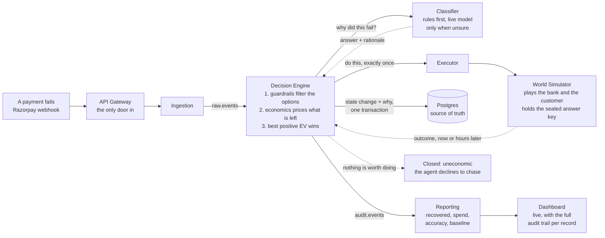

# Momotaro

**A payment failure and mandate recovery agent.** It watches payments,
mandates, checkouts and invoices as they fail, works out *why* each one
failed, and runs the one bounded, auditable intervention that matches that
root cause, instead of a generic retry.

Built for Razorpay's AI Buildathon, Track 03: AI Revenue Recovery.



Nine Go services, Postgres as the source of truth, Kafka for events, gRPC
between services. The diagram above is the story; the complete container map
with every protocol and edge is in
[`docs/DATA_FLOW.md`](docs/DATA_FLOW.md#2-container-view).

The full architecture, with every protocol and table-ownership rule, is
[`docs/ARCHITECTURE.md`](docs/ARCHITECTURE.md). The plain-English data
journey is [`docs/DATA_FLOW.md`](docs/DATA_FLOW.md).

## The idea, in one paragraph

A generic retry is the wrong answer to most payment failures. Retrying an
expired card cannot succeed however many times you try it, and retrying an
insufficient-funds failure tomorrow just burns an attempt and an SMS when
the money actually arrives on payday. So the agent classifies the failure,
prices every action it is allowed to take, and takes only the one worth
taking. When nothing is worth taking, it closes the record as uneconomic and
says so, which is a different outcome from escalating to a human. Product
reasoning is in [`docs/PRD.md`](docs/PRD.md).

## Prerequisites

- **Go 1.26+** (`go.mod` pins 1.26.5)
- **Docker** with Compose
- **Node 24+** for the dashboard (the lockfile is npm 11's; node 20's npm 10
  rejects it)

## Quick start

```bash
cp .env.example .env
make demo-up PROFILE=demo      # infra, migrations, all 9 services
cd web && npm install && npm run dev
```

Open <http://localhost:5173>, then use the **Demo Controls** page to seed a
batch (scenario `normal`, count 100, seed 7). Watch it fill in.

`PROFILE=demo` is not optional. Without it `DEMO_TIME_SCALE=1`, meaning every
wall-clock wait is real: a nudge takes up to 24 real hours to come back and
the batch never finishes. See "Troubleshooting" if numbers look wrong.

## Running it

### Start

| Command | What it starts |
|---|---|
| `make up` | infra only: Postgres, Redis, Kafka, Kafka UI |
| `make demo-up PROFILE=demo` | infra + migrations + all 9 services, logs to `.demo-logs/` |
| `make up-observability` | infra + Prometheus, Alertmanager, Grafana |
| `cd web && npm run dev` | the dashboard on :5173 |

`make demo-up` runs `make up` and `make migrate-up` first, so it is the only
command you need from cold.

To run observability alongside the demo, start it **first**, then bring up
the services. Both bring up the base stack, so starting them concurrently
races:

```bash
make up-observability HOST_IP=$(hostname -I | awk '{print $1}')
make demo-up PROFILE=demo
```

### Stop

| Command | What it stops |
|---|---|
| `make demo-down` | the 9 services, leaves infra running |
| `make down` | all containers, base stack and observability, keeps data |

### Clean

| Command | What it removes |
|---|---|
| `make down-clean` | all containers **and their volumes**, so Postgres and Kafka start empty next time |
| `make demo-reset` | just the decision-engine Kafka consumer group, to unwedge a stuck stack without losing data |

A full reset from anything is:

```bash
make demo-down && make down-clean && make demo-up PROFILE=demo
```

## Using it

### Seed a batch

**From the dashboard** (recommended): the **Demo Controls** page. Pick a
scenario, a count and a seed. This writes a sealed ground truth, so the batch
gets a classification accuracy score and a naive-baseline comparison.

Four scenarios, each built to make one behaviour visible:

| Scenario | What it shows |
|---|---|
| `normal` | a realistic spread across every root-cause bucket |
| `bank-outage` | one bank unavailable, so per-bucket reporting shows a systemic spike |
| `salary-day` | heavy insufficient-funds, so salary-window retry timing is the story |
| `dead-cards` | expired and blocked cards, so nudge-versus-retry and the uneconomic close are visible |

**From the CLI**, equivalent:

```bash
make batchgen                     # 100 records
make batchgen COUNT=50 SEED=7     # reproducible inputs
```

Both paths write the same sealed `ground_truth` rows and publish to
`raw.events`. `batchgen` bypasses the Gateway on purpose: only a `demo/` or
`scripts/` component may ever write the answer key, so there is no public
endpoint that can.

### Send live webhook traffic

```bash
export API_KEY=momotaro-demo-key   # or whatever your .env has
make loadgen                       # 5 events/s for 5 minutes
make loadgen RATE=10 DURATION=2m
make loadgen RATE=2 EVENTS=200
```

This posts to `POST /v1/webhooks/payment-failed`, the same route a real
payment gateway would call. It carries no ground truth by design, so the
batch it fills has no accuracy score, and the dashboard says so rather than
showing an empty panel.

### Talk to the API directly

Everything external is on **<http://localhost:8090>**. Start with the
self-documenting route list:

```bash
curl http://localhost:8090/v1/help
```

Open it in a browser and it renders as a page. The full contract is
[`docs/API_GATEWAY.md`](docs/API_GATEWAY.md).

## Observability

```bash
make up-observability HOST_IP=$(hostname -I | awk '{print $1}')
```

| Service | URL | Notes |
|---|---|---|
| Prometheus | <http://localhost:9900> | 9900, not 9090: 9090 is ingestion's gRPC port |
| Alertmanager | <http://localhost:9901> | |
| Grafana | <http://localhost:9902> | `admin` / `momotaro`, or anonymous viewer |
| Kafka UI | <http://localhost:8080> | comes up with `make up` too |

Two dashboards are provisioned automatically (service health, business
reliability) and five alert rules are loaded: Kafka consumer lag, LLM
fallback rate, stopping-rule violations, incomplete audit trails, and
impossible audit transitions.

**`HOST_IP` matters.** Prometheus runs in a container and scrapes the nine
services running on your host. The default `host.docker.internal` does not
reach a WSL2 distro under Docker Desktop's NAT networking, which shows up as
every target `down`. Passing your real IP fixes it. Check **Status >
Targets** in Prometheus; all nine should be `up`.

## Ports

| What | Port |
|---|---|
| **API Gateway (everything external)** | **8090** |
| Dashboard (Vite dev server) | 5173 |
| Postgres / Redis / Kafka | 5432 / 6379 / 9092 |
| Kafka UI | 8080 |
| Prometheus / Alertmanager / Grafana | 9900 / 9901 / 9902 |

Each service also binds a fixed gRPC and metrics port so all nine can run at
once and Prometheus has something stable to scrape:

| Service | gRPC | Metrics |
|---|---|---|
| ingestion | 9090 | 9091 |
| classifier | 9190 | 9191 |
| executor | 9192 | 9193 |
| audit | 9194 | 9195 |
| decision-engine | 9196 | 9197 |
| api-gateway | 9198 | 9199 |
| reporting | 9200 | 9201 |
| world-simulator | 9202 | 9203 |
| notification-simulator | 9204 | 9205 |

## Troubleshooting

**A service refuses to start naming a variable.** `.env` is gitignored, so a
PR that adds a newly required variable updates `.env.example` and cannot
touch your `.env`.

```bash
make check-env     # lists keys in .env.example that your .env lacks
```

It never fails the build: some keys are optional, and some are set only by
`configs/demo.env` under `PROFILE=demo`.

**Most records escalate, recovery is near 18%, spend is tiny.** The demo
profile did not apply. Confirm it:

```bash
make --eval='__show:; @echo $(DEMO_TIME_SCALE)' __show PROFILE=demo   # must print 300000
```

**Sourcing `configs/demo.env` into your shell does nothing.** The Makefile's
own `include .env` outranks the environment, so a sourced value is silently
discarded. Always use `PROFILE=demo`.

**The dashboard shows convincing numbers with no backend running.** That is
the built-in mock engine. Set `VITE_API_BASE_URL=http://localhost:8090` in
`web/.env.local`. The UI shows a banner when it is in mock mode.

**No accuracy score or baseline on a batch.** That batch has no ground
truth, so it came from live webhook traffic rather than a seeded batch. This
is expected, not a bug.

**The stack is wedged after a bad message.** `make demo-reset` clears the
decision-engine consumer group without touching Postgres.

**Do not run `make test-integration` against a live demo stack.** Its tests
publish to the same `raw.events` topic and delete records in cleanup.

## Development

```bash
make test               # unit tests only, no infrastructure
make test-integration   # brings up the stack, runs every tier
make check              # what CI runs: fmt, vet, proto lint, build, unit tests
make help               # every target
```

A bare `go test ./...` runs neither the integration nor the end-to-end tier,
because both sit behind build tags, so it passes while testing almost nothing
about the pipeline. [`AGENTS.md`](AGENTS.md) explains the three tiers.

To watch one record travel the whole pipeline with every service logging:

```bash
go test -count=1 -tags='integration e2e' -run TestSmokeBatch -v ./test/e2e/
```

## Layout

| Path | What it is |
|---|---|
| `services/` | the seven product services, each with `cmd/`, `internal/`, a Dockerfile and its own `AGENTS.md` |
| `demo/` | hackathon-only stand-ins: the world simulator and the notification simulator |
| `internal/platform/` | the only shared code: clock, config, logger, gRPC interceptors, Kafka and Postgres helpers |
| `proto/` | gRPC contracts, and the generated code, which is committed |
| `migrations/` | schema, applied with goose |
| `scripts/` | three compiled Go CLIs: `migrate`, `batchgen`, `loadgen`. Each has `-h` |
| `test/e2e/` | end-to-end tests that run the real binaries |
| `web/` | the dashboard (Vite, React, TypeScript) |
| `docs/` | why the system is shaped the way it is |

`demo/` is a separate top level from `services/` on purpose, so it is obvious
from the layout alone which components are the product and which exist only
to make a demo possible without a real bank. Swapping a simulator for a real
provider is a config change, not a redesign.

## Docs worth reading, in order

| Doc | What it answers |
|---|---|
| [`docs/DATA_FLOW.md`](docs/DATA_FLOW.md) | how data moves, start to finish, in plain English |
| [`docs/ARCHITECTURE.md`](docs/ARCHITECTURE.md) | the design and why each piece is shaped that way |
| [`docs/API_GATEWAY.md`](docs/API_GATEWAY.md) | the external contract, every route and payload |
| [`docs/PRD.md`](docs/PRD.md) | the product reasoning and the economics model |
| [`docs/CONCEPTS.md`](docs/CONCEPTS.md) | what each pattern is and why this system needs it |
| [`docs/DECISIONS.md`](docs/DECISIONS.md) | append-only: what was chosen and why |
| [`docs/INCIDENTS.md`](docs/INCIDENTS.md) | append-only: what broke and what changed as a result |
