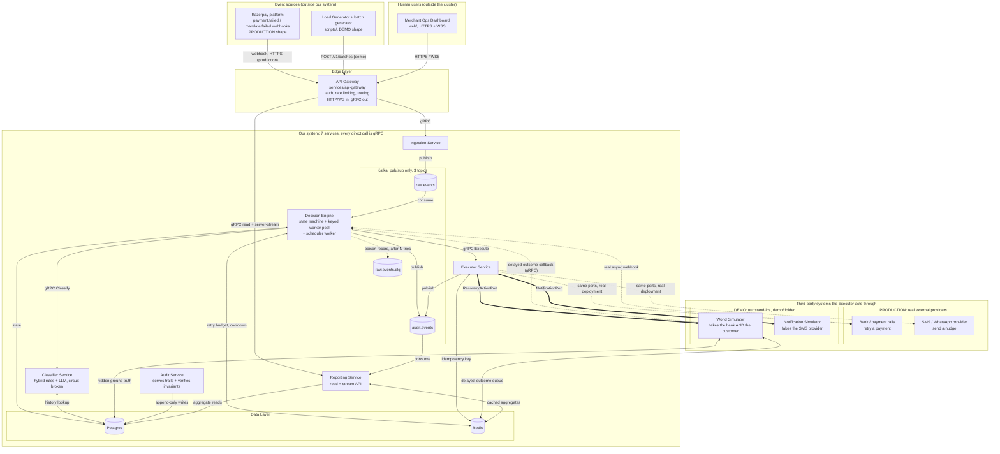
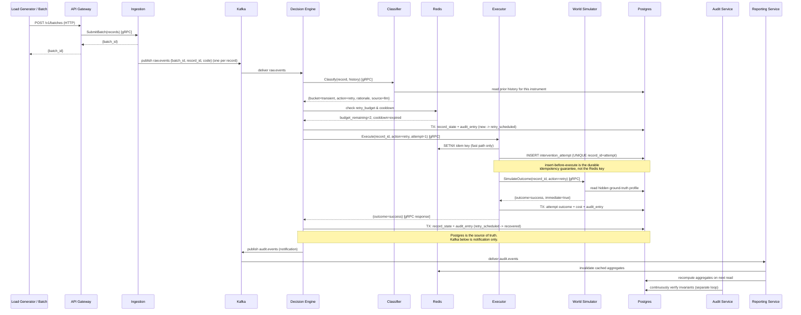
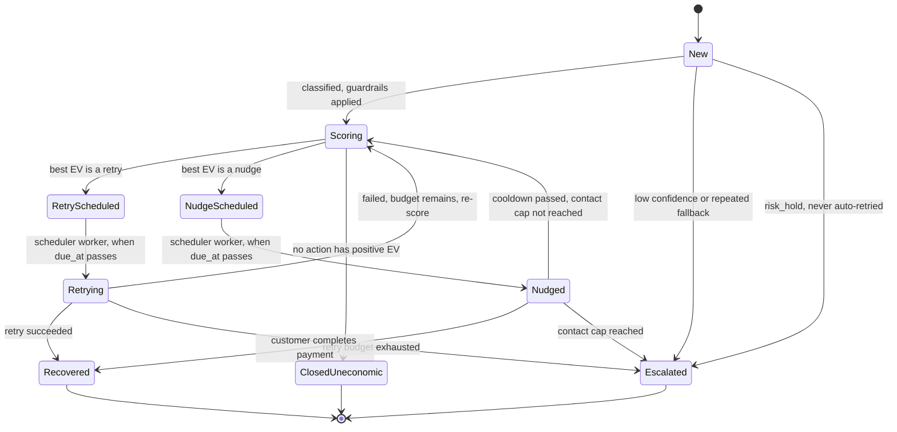
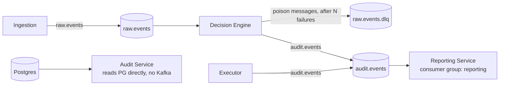
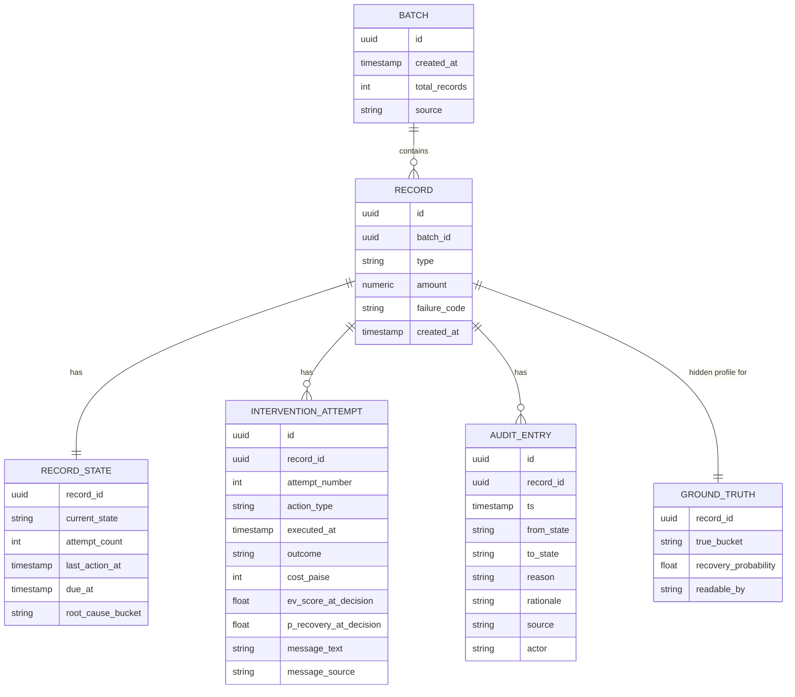

# System Design: Momotaro (Payment Failure & Mandate Recovery Agent)

Track 03: AI Revenue Recovery

This is the authoritative system design doc. If you are an agent picking up
work on one service, read section 2 (protocol boundaries), section 9 (proto
contract management), and your own service's part of section 4 before writing
code, the rest of this doc explains why those rules exist. If you are
building the dashboard, you don't need this file at all, see
`docs/API_GATEWAY.md` instead.

## 0. System at a glance (plain English)

The main app (a real, working product, deployable independently of any demo
tooling) is 7 services:

- **API Gateway**: the only door in. Translates HTTP/WebSocket from outside
  into gRPC calls inside. Checks the API key, applies basic rate limiting.
- **Ingestion**: the front of the pipeline. Accepts failure events two ways
  (a live webhook feed in production, a submitted batch for demos and
  backfills, see section 0a) and hands each record onward.
- **Decision Engine**: the brain. Owns each record's state machine, asks
  the Classifier what's wrong, tells the Executor what to do, decides when
  to stop. It also runs the **scheduler worker**, the piece that notices
  "this record's cooldown has elapsed" or "the salary window has arrived"
  and wakes the record back up. Without that worker, anything scheduled for
  later simply never happens (section 7a).
- **Classifier**: figures out *why* a record failed and what to try,
  using a chain of reasoning steps that ends in a plain rule if all else
  fails.
- **Executor**: actually carries out the chosen action (retry, nudge),
  exactly once, no matter how many times it's asked.
- **Audit**: serves the permanent, never-edited history of what happened to
  each record, and continuously re-checks that the system's own promises
  held (no cap exceeded, no gap in any record's trail). It does not write
  that history, the service that made each change writes it in the same
  database transaction, see section 10a.
- **Reporting**: adds it all up into the numbers a human actually wants to
  see (recovered amount, recovery rate, accuracy).

Two more pieces make it possible to demo this without a real bank or real
customers, and they live in their own `demo/` folder, deliberately separate
from the 7 services above so it's obvious they're not part of the shipped
product:

- **World Simulator**: pretends to be "reality": when the Executor tries a
  retry or a nudge, this decides (using a hidden, seeded answer key) whether
  it actually works, sometimes right away, sometimes after a delay, like a
  real customer taking a while to notice a nudge.
- **Notification Simulator**: pretends to be an SMS/WhatsApp provider, just
  logs "a message would have been sent here."

How they talk to each other, in one sentence: everything **outside** the
cluster (dashboard, load generator) speaks HTTP/WebSocket to the Gateway
only; everything **inside** the cluster speaks gRPC directly to whichever
service it needs an answer from; and two Kafka topics carry facts that
don't need an immediate answer (new work arriving, and a record's audit
trail of what just happened) out to whoever's listening.

The rest of this document is the detailed why and how, section by section.

## 0a. How it runs for real vs. how we demo it

This distinction matters, and getting it wrong is what makes a project look
like a script instead of a product. Momotaro is an **always-on background
agent**, not a tool someone opens and feeds a file to.

**In production**, nobody hands it data and nobody presses start:

1. A customer's payment or mandate fails inside Razorpay.
2. Razorpay emits a `payment.failed` / `mandate.failed` webhook, the same
   way it already notifies merchants of events today.
3. Ingestion receives that webhook and the record enters the pipeline within
   seconds. The agent diagnoses it, intervenes, waits, escalates, all on its
   own, with no human in the loop.
4. The merchant's finance lead never "runs" anything. They open the
   dashboard when they want to see what the agent has been doing, the same
   way you'd check a monitoring dashboard. Their only real interventions are
   reading the escalation queue (records the agent deliberately refused to
   keep chasing) and adjusting policy caps.

So the record trickles in one at a time, continuously, forever.

**In the demo**, we cannot wait for real failures to trickle in over weeks,
and we need a *measurable* result inside a few minutes. So we submit a
prepared batch of 50 to 100 synthetic failures at once and watch the agent
chew through them. That is the only difference: **how records arrive**.
Everything downstream (diagnosis, decisioning, guardrails, execution,
audit, reporting) is byte-for-byte the same code path.

**Both entry points are real and both stay in the product**, this is not a
demo hack bolted onto a production design:

- `POST /v1/webhooks/payment-failed`: the production path, one event at a
  time, continuously.
- `POST /v1/batches`: the demo path, and also genuinely useful in
  production for backfilling a period the agent was offline for, or
  reprocessing after a policy change. Real payment systems all have this
  kind of replay/backfill entry point.

Both converge immediately onto the same `raw.events` Kafka topic, and
nothing downstream can tell which door a record came through. That
convergence is exactly why a batch demo is honest evidence about production
behavior, we are not demoing a different system than the one we designed.

## 1. Design goals driving every choice below

- Every money-adjacent action must be idempotent, because both Kafka and gRPC
  clients can redeliver/retry, at-least-once is the assumption everywhere.
- Every state transition must be replayable from the audit log alone.
- Diagnosis is a hybrid of deterministic rules and bounded LLM reasoning
  (section 5), never a single opaque model call and never a pure lookup
  table, see PRD section 2a for why.
- Stateless services scale horizontally; the only real state lives in
  Postgres and Redis, not in service memory.
- Language: Go for every service. Deployment target: Kubernetes (minikube for
  the hackathon demo).
- **The main app is a real product, not a demo harness.** The 7 services in
  section 0 are what would ship. Anything that only exists to make a
  hackathon demo possible without real banks/customers (World Simulator,
  Notification Simulator) lives in `demo/`, not `services/`, and is wired in
  through the same port/interface a real integration would use later, see
  section 3b.

## 2. Communication protocol boundaries (decided)

This is the rule every service must follow, stated once here so it does not
drift between services built by different agents:

- **Outside the cluster** (dashboard, load generator, any external caller
  talking to the API Gateway): whatever protocol fits the use case, HTTP/REST
  for requests, WebSocket for live dashboard updates. Not fixed to one
  protocol, this boundary is allowed to be pragmatic.
- **Inside the cluster, once a request crosses the API Gateway**: every
  direct, synchronous service-to-service call is gRPC. No internal HTTP
  between services, no exceptions, this keeps every service's contract
  strongly typed and generated from one shared source (section 9).
- **Kafka** is used only where pub/sub or event-stream semantics is actually
  the right fit: buffering ingestion so processing rate can differ from
  ingestion rate, and broadcasting "this happened" events to independent
  consumers (Audit, Reporting) without making the main decision path wait on
  them. Anything that is naturally a request/response call is gRPC, not a
  Kafka round trip, even if an earlier draft of this doc modeled it that way.
- **Hard rule, no exceptions**: the dashboard, or any other external client,
  only ever talks to the API Gateway. It never opens a connection to
  Reporting, Audit, Postgres, or anything else inside the cluster directly.
  This is what makes `docs/API_GATEWAY.md` a complete contract for a UI
  agent, and it's a real security boundary, not just tidiness, internal
  services never need to defend themselves against untrusted external
  input, only the Gateway does.

## 2a. Repo layout, Go modules, and per-service containers (decided)

Every service is independently built, independently imaged, and
independently deployed. That is the requirement. This section says exactly
how, using the conventional Go monorepo layout so nothing here is a surprise
to anyone who has worked on one before.

### Layout

```
momotaro/
  go.mod                        single module for the repo
  proto/                        contracts, buf-managed
    <service>/v1/*.proto
    gen/                        committed generated Go code
  migrations/                   shared, ordered, one tool
  internal/platform/            the ONLY shared code
    clock/  logger/  config/  interceptors/  kafka/  pg/
  services/                     the 7 product services
    classifier/
      cmd/main.go               entrypoint
      internal/                 private to this service, compiler-enforced
      Dockerfile                its own image
      AGENTS.md                 its boundary contract
    ...
  demo/                         hackathon-only stand-ins, same shape
  web/                          dashboard, not Go
  scripts/                      generators, loadgen, deploy helpers
  docs/
```

### One module, and why that is the conventional choice here

A single `go.mod` at the root, not one per service.

The reason is that a Go module boundary is a *distribution and dependency
versioning* boundary, not an isolation boundary. It matters when separate
teams release on separate cadences or when a package is consumed externally
via `go get`. Neither applies to seven services that build and deploy
together from one repo. What it would cost us is real: every service module
would need the shared module resolved locally through a committed `go.work`
that six agents on six machines must keep in agreement, and every Docker
build would need multiple modules copied into its context, which partly
undoes the per-image independence we actually want.

Service isolation comes from `internal/` instead, and it is **stricter**
than modules because the compiler enforces it rather than a reviewer:

- `services/classifier/internal/**` can be imported **only** by code under
  `services/classifier/`. An Executor agent importing Classifier internals
  is a compile error, not something to catch in review.
- `internal/platform/**` is the only shared code, importable by any service.
  If two services need the same logic it moves there in its own PR. It is
  never imported across service trees.
- Services never call each other in-process regardless. Cross-service
  communication is gRPC, always, per section 2.

If a service ever genuinely needs to leave this repo, adding a `go.mod` to
its directory is mechanical. We are not locked in.

### Per-service containers

- One multi-stage `Dockerfile` per service, living **in that service's
  directory**, producing one image containing one binary. One k8s Deployment
  each, scaled independently (section 15).
- The builder stage compiles only that service:
  `go build -o /app/svc ./services/classifier/cmd`. The runtime stage is
  distroless or alpine and contains the binary and nothing else. No Go
  toolchain, no source, no other service's code ships in the image.
- **The build context is the repo root, not the service directory.** This
  catches people out, so it is stated explicitly:

```bash
# correct
docker build -f services/classifier/Dockerfile -t momotaro/classifier .

# wrong, will fail: cannot see go.mod or internal/platform
docker build services/classifier/
```

  The context has to include `go.mod` and `internal/platform`. A root
  `.dockerignore` (excluding `web/node_modules`, `.git`, docs, build
  artifacts) keeps that context small and the builds fast.
- Each service's image is built, tagged, and deployed on its own. Nothing
  about sharing a module makes them ship together.

## 3. High-level architecture



Reading that diagram: solid thick arrows from the Executor are what runs in
this repo, dotted arrows are what would replace them in a real deployment.
The simulators are drawn **outside** the cluster box on purpose. They are
deployed as pods next to everything else (they have to be, they are our
code), but conceptually they sit where a third party would sit, they are the
only components in this repo whose job is to be something we do not own.

**Why these pieces, specifically:**

- **API Gateway translates protocol, not just routes**: external HTTP/WS in,
  internal gRPC out. It is the one place the protocol boundary from section 2
  is actually implemented.
- **Kafka kept narrow, three topics, not one per hop**: classification and
  execution are request/response operations (the Decision Engine needs the
  answer immediately to make its next move), so they are gRPC calls. Kafka
  is left doing only what it is actually good at: decoupling ingestion from
  processing (`raw.events`), broadcasting completed work to independent
  consumers that must never block the main path (`audit.events`), and
  quarantining records that cannot be processed at all
  (`raw.events.dlq`, section 8b).
- **World Simulator as a first-class service, not a test mock**: there is no
  real bank or customer to call in a hackathon, something has to stand in for
  "how does reality respond," and that something needs to be principled
  enough to produce trustworthy accuracy numbers (section 6). It lives in
  `demo/`, not `services/`, see section 3b.

## 3a. API Gateway: responsibilities and routes

The Gateway is a real Go service (`services/api-gateway`), not a config
file, it is one of the 7 main-app services. Its full external contract,
routes, request/response shapes, auth header, WebSocket message format, is
`docs/API_GATEWAY.md`, that document is the single source of truth for both
the Gateway's implementer and the dashboard's implementer, so they can never
drift apart. In system-design terms it owns three jobs and nothing else:

1. **Protocol translation**: HTTP/WebSocket in, gRPC out. It holds gRPC
   clients to Ingestion and Reporting, nothing else, it does not reach into
   Decision Engine, Classifier, Executor, or the data layer directly.
2. **AuthN**: validates the static shared API key header (section 17 covers
   why this, not real user auth, is the right call for a hackathon judge
   trying the system).
3. **Live-update relay**: on `WS /v1/batches/{batch_id}/live`, opens a
   server-streaming gRPC call to Reporting's `StreamBatchUpdates` and relays
   each message to the connected WebSocket client. It does not itself
   consume Kafka or query Postgres for this, that logic belongs to
   Reporting, see section 6a.

## 3b. Main app vs. demo-only components (ports and adapters)

The Executor never calls "the World Simulator" or "the Notification
Simulator" by name in its own code, it depends on two small interfaces
(defined as proto services, so this is enforced at compile time, not just by
convention):

- `RecoveryActionPort`: `SimulateOutcome(record_id, action) -> {outcome,
  immediate, resolves_at}`. In this repo, implemented by
  `demo/world-simulator`. In a real deployment, this would be implemented by
  a real bank/payment-gateway retry API and a real customer notification
  webhook, without changing a single line in `services/executor`.
- `NotificationPort`: `SimulateSend(record_id, channel, message) -> {sent}`.
  In this repo, implemented by `demo/notification-simulator`. In a real
  deployment, a real SMS/WhatsApp provider client.

This is why `demo/` is a separate top-level folder from `services/`: it is
structurally obvious, just from the repo layout, which components are the
shipped product and which ones exist only to make a hackathon demo possible
without real banks or real customers. Swapping a demo adapter for a real one
later is a config change (which gRPC endpoint the port dials), not a
redesign.

## 4. Request-path and event workflow: one record's lifecycle



Nudge-type actions can take the delayed path instead of the immediate one
shown above, `WSIM-->>EXE: {outcome=pending, resolves_at=...}`, in which
case Decision Engine parks the record in `Nudged` and the transition out of
it arrives later via `WSIM`'s own callback, see section 6.

Every gRPC call in the request path is guarded by an idempotency or budget
check before it acts, and every fact about what happened is broadcast onto
`audit.events` after the fact, that split (synchronous decisions vs.
asynchronous fact broadcasting) is the actual reason two different transport
mechanisms exist in this system.

## 5. Diagnosis: hybrid rules and LLM reasoning

The Classifier exposes one gRPC method:
`Classify(record, history) -> ClassificationResult{bucket, recommended_action, rationale, confidence, source}`.

- `source` is always one of `llm:<provider>` (e.g. `llm:claude`,
  `llm:openai`) or `rules_fallback`, logged on every call, so every
  classification is traceable to how it was actually produced, never
  ambiguous after the fact.
- The LLM call is constrained to the enumerated action menu via a structured
  response (tool-call style, not freeform text driving execution). `rationale`
  is the only freeform field, and it is explanatory, never itself executed.
  It is stored verbatim in the audit trail, this is what turns "root cause
  bucket" into something a judge can actually read and evaluate.
- **Provider is decided later, deliberately kept swappable now**: the LLM
  call sits behind a small internal `ClassifierProvider` interface, config
  driven (a priority-ordered provider list), not hard-wired to one vendor.
  This is not a placeholder for later cleanup, it is the actual design,
  because provider choice depends on cost/rate-limits that are still being
  evaluated (see `docs/PRD.md` open questions).
- **Provider chain, not a single call**: `Classify` tries providers in
  configured priority order, e.g. primary LLM provider -> secondary LLM
  provider (a different vendor) -> deterministic rules engine. Each hop in
  the chain is attempted only if the previous one times out, errors, or
  fails schema validation (names an invalid bucket/action). This buys
  resilience against any single provider's outage or rate limit, and the
  final rules-engine rung means the chain always terminates in a valid
  answer. Every hop actually taken is recorded in `source` as an ordered
  list (e.g. `["llm:claude:timeout", "llm:openai:ok"]`), so a judge (or a
  debugging agent) can see exactly what was tried, not just the final
  answer. Falling all the way to `rules_fallback` is itself the "one failure
  handled gracefully" demo moment.
- **Circuit breaker per provider, not just timeouts**: a timeout alone is
  not enough protection. If a provider is down, every single record pays the
  full 2s timeout before falling back, which at any real throughput turns
  one external outage into a pipeline-wide stall. So each provider in the
  chain sits behind a circuit breaker: after N consecutive failures the
  breaker opens, that provider is skipped entirely for a cooldown window
  (requests go straight to the next rung, usually `rules_fallback`), and a
  single trial request probes it before closing again. The breaker turns a
  provider outage from a throughput collapse into a barely visible dip, at
  the cost of some classification quality, which is exactly the right trade.
  `llm_circuit_state` is an exported metric (section 13).
  Breaker state is deliberately **per-pod and in-memory**, not shared: it is
  a local health observation, and a shared breaker would itself become a
  coordination point and a shared failure mode. Do not build distributed
  breaker state.
- **Cost-safety for load testing**: real LLM calls cost money per call and
  have rate limits, which matters once `scripts/loadgen` is firing hundreds
  of records per second. The load generator defaults to a `synthetic`
  classification mode (forces `rules_fallback`, no real API calls) for
  throughput/latency runs, and a small, separate `live` mode (real provider
  chain enabled) is used only for accuracy validation and the actual demo,
  where call volume is bounded and known in advance.
- **Guardrails never move downstream of the LLM's judgment**: retry caps,
  contact caps, cooldowns, and escalation triggers are enforced entirely in
  the Decision Engine, after the Classifier responds, and are never
  influenced by what any provider in the chain recommended. The chain
  recommends, the deterministic engine decides whether that recommendation
  is currently allowed to happen.

## 5a. Intervention economics: expected-value action selection

Product rationale is `docs/PRD.md` section 2b. This is the mechanism.

**Where it lives**: entirely inside the Decision Engine, as a deterministic
scoring step that runs *after* the Classifier responds and *after* the
guardrails have filtered the action menu. Order matters and is fixed:

1. Classifier returns `{bucket, recommended_action, rationale}`.
2. Guardrails (retry cap, contact cap, cooldown, recovery window) compute
   the set of **allowed** actions. A guardrail can only ever remove options,
   never add one.
3. The economics scorer computes `EV` for each allowed action and picks the
   maximum. If `max(EV) <= 0`, the record terminates as `ClosedUneconomic`.
4. The chosen action's timing is set by the scheduling policy below, not by
   a fixed backoff.

This ordering means the LLM's recommendation is one input to step 3, not the
final word: the model proposes, the guardrails constrain, and deterministic
economics decides. A judge asking "so does the LLM decide how to spend
money?" gets a clean no.

**Cost model** (checked-in config, `configs/intervention_costs.yaml`):
per-action `direct_cost` in paise (SMS, WhatsApp, retry attempt fee) plus an
`indirect_cost` term used to price the authorization-rate damage from
repeated card retries, which is a real cost that does not appear on any
invoice. Keeping this in config rather than code means a judge can see the
numbers and we can defend them.

**Probability model**: `P(recovery | action, bucket, attempt_no)` comes from
a two-tier lookup:

- Tier 1, a static prior table of plausible industry values, checked in
  alongside the cost model and cited as assumptions.
- Tier 2, observed rates computed from this system's own
  `INTERVENTION_ATTEMPT` history once there is enough volume, blended over
  the prior. The agent gets calibrated by watching its own results.

**The integrity rule, non-negotiable**: these probabilities are never
sourced from the `GROUND_TRUTH` table. That table is the sealed answer key
(section 6), and letting the decision path read it would mean the agent
knows in advance which records are recoverable, making every accuracy and
recovery number in the demo meaningless. Enforced the same way as the rest
of the ground-truth isolation: only World Simulator and the Reporting
accuracy scorer hold a query path to it, and the Decision Engine holds none.

**Cause-aware retry scheduling** (replaces fixed exponential backoff):

| Root cause | Retry timing policy | Why |
|---|---|---|
| `insufficient_funds` | next salary-credit window (1st to 7th), or next payday if already inside it | the money genuinely is not there yet, retrying tomorrow just burns an attempt and an SMS |
| `bank_timeout` / rail congestion | minutes, short exponential backoff | funds were available, the rail was busy, this is the classic transient case |
| `hard_decline` (expired/blocked instrument) | do not retry at all, retrying cannot succeed, only a method update can | a retry here is pure cost with zero recovery probability |
| `risk_hold` | do not retry, escalate to human | never auto-retry around a risk decision |

The demo-time scale factor (section 17) compresses these windows so a live
demo can show a salary-window retry firing without waiting until the 1st.

## 5b. Nudge composition: the clearest right-tool-for-the-job LLM use

When the chosen action is a nudge, something has to write the actual message
the customer would receive. This is where an LLM is unambiguously the right
tool, and it is worth being explicit about why, because the contrast with
classification is the point.

Classification can be done with a lookup table, and ours falls back to
exactly that. Writing a short, natural, code-mixed Hinglish message that
tells someone their autopay failed and what to do about it, in a register
that does not read like a form letter, is something rules genuinely cannot
do well. Templates produce stilted text; an LLM produces something a person
would actually read. That is generation, which is what these models are
best at, as opposed to classification, where they are merely adequate.

**Where it lives**: as a second RPC on the Classifier,
`ComposeNudge(record, bucket, locale) -> {message, source}`, **not** a new
service and not inline in the Executor. The reason is that the Classifier
already owns every piece of LLM plumbing in this system: the provider
chain, the circuit breakers, the timeout budgets, the cost-safety switch
for load tests. Putting a second LLM call anywhere else would mean
duplicating all of it, and would give us two independent places where an
LLM outage has to be handled correctly.

**Constraints, same trust model as section 5:**

- The LLM writes the *wording*. It never chooses whether to send, who to
  send to, or how many times. Those are guardrail decisions (section 5a),
  already made before this call happens.
- **Fallback is a static Hinglish template per root-cause bucket.** If the
  provider chain is exhausted, the nudge still goes out, just in
  boilerplate. `source` records which it was, so the audit trail
  distinguishes a generated message from a templated one.
- Output is length-capped (SMS-realistic) and validated: no invented
  amounts, no invented dates, no payment links beyond the one we pass in.
  The record's real amount and due date are interpolated by us, not written
  by the model, because a model inventing a figure in a message about money
  is a serious failure mode rather than a cosmetic one.
- The generated text is stored on `INTERVENTION_ATTEMPT.message_text`, so
  the demo can show the actual message inside a record's audit trail rather
  than describing it.
- Counts toward the load-test cost-safety rule (section 5): synthetic mode
  forces templates and makes no provider calls.

Scope note: text only. The track lists "Hinglish voice recovery" as a
direction, but text-to-speech adds real work for little additional credit,
so the message is composed and logged, never spoken. The Notification
Simulator logs what it would have sent (section 3b).

## 6. World simulator

There is no real bank or real customer in a hackathon, something has to
stand in for "how does reality respond to this intervention," and it needs
to be principled enough that the resulting accuracy numbers are actually
measurements, not a scripted happy path.

- The synthetic batch generator seeds each record with a hidden ground-truth
  profile at creation time (e.g. this transient failure resolves on retry
  with 80% probability, this hard decline only resolves if nudged and even
  then only 15% of the time, this one is genuinely unrecoverable).
- This lives in its own `ground_truth` table (section 10), readable only by
  the World Simulator and the Reporting Service's accuracy scorer, **never**
  by the Classifier or Decision Engine. This separation is what makes the
  evaluation honest, the agent is never able to peek at the answer key it is
  being scored against.
- `SimulateOutcome(record_id, action) -> {outcome, delay}` rolls against that
  hidden probability. A nudge action can return a delayed outcome (modeling a
  customer taking hours to act) as a scheduled follow-up rather than a
  blocking call.
- This is also where the demo's accuracy numbers come from: "of the records
  classified as transient, X% actually were, per the hidden ground truth,"
  a claim that would be unfalsifiable without a simulator holding a real
  answer key.

**Delayed outcomes, and how they actually fire.** A retry is fast in real
life too (seconds), so it stays a synchronous `SimulateOutcome` call. A
customer responding to a nudge is not, that can realistically take hours,
and something concrete has to make the "wake up later and deliver the
answer" part actually happen. This is a standard pattern (the same shape
real payment providers use for async webhooks instead of holding an HTTP
call open for hours):

1. When `SimulateOutcome` is called for a nudge-type action, World Simulator
   rolls its hidden probability immediately, but instead of returning the
   result right away, it returns `{outcome=pending, resolves_at=<timestamp>}`
   and privately schedules the real answer.
2. Scheduling means one `ZADD` into a Redis sorted set
   (`wsim:delayed_outcomes`, score = `resolves_at` unix time, member =
   `record_id:attempt_number:outcome`), the classic lightweight delayed-job
   queue pattern, no new infra needed beyond the Redis already in the stack.
3. A background loop inside World Simulator (a simple ticker, no separate
   service) polls that sorted set every tick
   (`ZRANGEBYSCORE wsim:delayed_outcomes -inf <now>`), and for every entry
   that's due, removes it (`ZREM`) and calls
   `DecisionEngine.ReportDelayedOutcome(record_id, attempt_number, outcome)`
   [gRPC], which resumes that record's state machine exactly as if the
   answer had arrived synchronously.
4. Both the tick interval and `resolves_at` itself are computed from a
   configurable demo-time scale factor (section 17), so "hours" compress to
   seconds for a live demo without changing any logic, only a config value.

This entire mechanism lives inside `demo/world-simulator`, it is not part of
the main app, a real deployment would delete this whole component and
receive real async webhooks from a real bank/notification provider on the
same `RecoveryActionPort` interface instead (section 3b).

## 6a. Live updates: WebSocket via the Gateway

The dashboard needs to fill in live as records resolve, without polling and
without ever touching an internal service directly (section 2). The design:

- **Reporting Service** exposes a server-streaming gRPC method,
  `StreamBatchUpdates(batch_id) -> stream BatchUpdate`. Reporting already
  consumes `audit.events` for its aggregates, this method just also pushes
  each relevant event to any open stream subscribed to that `batch_id`,
  same consumption, one more fan-out target.
- **API Gateway** is the only thing that terminates a WebSocket connection
  from a browser. When a client opens `WS /v1/batches/{batch_id}/live`
  (`docs/API_GATEWAY.md`), the Gateway opens one `StreamBatchUpdates` gRPC
  call to Reporting and relays each message onto the WebSocket verbatim.
- The Gateway holds no Kafka client and no Postgres connection for this,
  consistent with its one job being protocol translation (section 3a),
  Reporting owns the actual data and fan-out logic.

This is deliberately a real push mechanism, not polling dressed up, and it
never requires the browser to know Kafka, gRPC, or any internal service
exists.

## 7. Decision Engine state machine



`Scoring` is the economics gate from section 5a, and it is deliberately a
real state rather than an inline branch: every record passes through it
before any money is spent, and re-enters it after every failed attempt, so
an action that was worth trying on attempt 1 can be judged not worth trying
on attempt 3 as the remaining probability drops. `ClosedUneconomic` is a
terminal state distinct from `Escalated`, the first means "we decided this
is not worth chasing," the second means "a human should decide."

`RetryScheduled` and `NudgeScheduled` are **waiting** states: the record
sits there with a `due_at` timestamp until the scheduler worker (section 7a)
picks it up. Nothing polls them from the request path.

Every transition is a row in `AUDIT_ENTRY`, written in the same database
transaction as the state change itself (section 10a), so the audit trail is
literally a replay of this diagram per record, not a separate log format.
The `Nudged -> Recovered` and `Nudged -> Scoring` edges can be driven
either by an immediate `Execute` response or by World Simulator's delayed
`ReportDelayedOutcome` callback (section 6), the state machine itself does
not care which, both arrive at Decision Engine the same shape.

## 7a. The scheduler worker: how time-based work actually advances

Without this component the system cannot function, and it is worth being
blunt about why. Two of our core behaviours are inherently "come back
later":

- **Cause-aware retry timing** (section 5a): an `insufficient_funds` retry
  must wait for the salary window, potentially days away.
- **Cooldowns**: a record that just got nudged must not be touched again
  until its cooldown elapses.

Neither is triggered by an incoming Kafka message or gRPC call. Something
has to notice that a deadline has passed. That something is a **scheduler
worker running inside the Decision Engine**, not a separate service,
because deciding what happens to a record next is precisely the Decision
Engine's job and splitting it out would only create a service that has to
reach back into Decision Engine's state anyway.

**Mechanism** (deliberately Postgres, not a Redis timer, because a missed
retry is lost revenue and this must survive a restart):

- `RECORD_STATE` carries a nullable `due_at` timestamp. When the Decision
  Engine parks a record in `RetryScheduled` or `NudgeScheduled`, it sets
  `due_at` to the computed time from the cause-aware timing policy.
- Every Decision Engine pod runs a background ticker that polls:

```sql
SELECT record_id FROM record_state
WHERE current_state IN ('RetryScheduled','NudgeScheduled')
  AND due_at <= now()
ORDER BY due_at
LIMIT :batch_size
FOR UPDATE SKIP LOCKED;
```

- `FOR UPDATE SKIP LOCKED` is the load-bearing detail. It is the standard
  Postgres job-queue pattern and it means **every replica can poll
  concurrently and safely**: each pod claims a disjoint set of rows, no
  leader election, no distributed lock, no risk of two pods actioning the
  same record. Scaling the Decision Engine scales the scheduler for free.
- Claimed records re-enter the normal `Scoring` path, so scheduled work and
  fresh work run through identical logic. There is no second code path to
  keep in sync.

**Invariant worth stating explicitly**, because two independent things now
write `RECORD_STATE`: a record is only ever claimable by the scheduler while
it is in a waiting state, and only ever touched by the Kafka consumer path
while it is not. The two paths cannot contend for the same record because
the states they act on are disjoint, and the row lock covers the transition
itself.

In production the same worker is what would fire a real bank retry on the
1st of the month. It is not demo scaffolding.

## 8. Kafka topic map (pub/sub only)



`raw.events` is partitioned by `record_id`, so per-record processing order is
preserved even with multiple Decision Engine consumers. Everything else in
the record's lifecycle (Classify, Execute, SimulateOutcome) is a direct gRPC
call, not a topic.

Note what the Audit Service does **not** do: it is not a Kafka consumer.
Since audit rows are written transactionally with their state changes
(section 10a), Audit reads Postgres directly. Putting it on Kafka would only
reintroduce the possibility of it holding a different view of history than
the database, which is precisely the bug section 10a exists to remove.
`audit.events` therefore has exactly one consumer group, Reporting, and its
only jobs are cache invalidation and driving the live dashboard stream.

## 8a. Consumer concurrency: why naive consumption cannot meet the NFR

This is the single most important performance decision in the system, and
getting it wrong silently caps throughput at roughly 2% of target.

The Decision Engine consumes a record and then makes a **blocking** gRPC
call to the Classifier, which may spend up to 2s waiting on an LLM
(section 5). A conventional consume-one-then-process loop therefore
processes about 0.5 records/sec per partition. Our NFR is 50 records/sec
(`docs/PRD.md` §10). Those two numbers are irreconcilable by adding
partitions alone, we would need ~100 of them.

**The fix is key-level parallel consumption**, not more partitions:

- Each Decision Engine pod runs a bounded worker pool. A fetched record is
  dispatched to worker `hash(record_id) % pool_size`.
- Because dispatch is keyed on `record_id`, all events for the *same* record
  always land on the same worker and stay strictly ordered. Different
  records process concurrently. We keep the ordering guarantee that
  partitioning bought us while removing the head-of-line blocking that was
  destroying throughput.
- A single pod with a pool of 32 comfortably covers the target even with a
  2s LLM call, and the pool size is the tuning knob that the Phase 6 load
  test calibrates.

**Offset management is the trap here, and it must be built deliberately.**
Because records complete out of order, committing the offset of whatever
finished most recently would silently discard the records still in flight
behind it on a crash. The rule: track completed offsets per partition and
commit only the **highest contiguous completed prefix**. An unfinished
record at offset N pins the commit point at N-1 no matter how many later
offsets have finished. Anything else trades data loss for a simpler
implementation, which is not a trade we can make on money movement.

## 8b. Poison messages and the dead letter queue

Without this, one malformed record can wedge a partition permanently.

- A record whose processing fails for a non-transient reason (unparseable
  payload, a state transition the machine considers impossible) is retried a
  bounded number of times, then published to `raw.events.dlq` with the
  failure reason attached, and its offset is committed so the partition
  moves on.
- DLQ depth is a monitored metric with an alert (section 13). A message
  landing there means a bug, not a business outcome, and it should be
  visible rather than silently swallowed.
- Records in the DLQ are **not** counted as recovered, escalated, or
  uneconomic. They are counted as processing failures and reported
  separately, because folding a crash into a business metric would make the
  batch report dishonest.
- This is deliberately distinct from `Escalated`. Escalation is the agent
  making a considered decision about a valid record. The DLQ is the system
  admitting it could not process an input at all.

## 9. gRPC contract management (this section matters most for concurrent, multi-agent development)

Multiple agents will build different services in parallel, on different
branches, likely on different machines. The single most important thing to
lock down before that starts is the `.proto` contract between services,
otherwise two agents each building one end of the same call will drift and
nothing will compile together at integration time.

- All `.proto` files live in `proto/`, one subfolder per service
  (`proto/classifier/v1/classifier.proto`, `proto/executor/v1/executor.proto`,
  etc.), and are written and merged **before** the corresponding service
  implementation starts, not alongside it.
- Generated Go code is committed to the repo under `proto/gen/`, not
  generated on the fly per build. This means an agent on any machine can
  `go build` without needing a matching protoc/buf toolchain version
  installed, removing an entire class of "works on my machine" failures
  between agents working concurrently.
- A proto change is its own pull request, reviewed and merged before any
  service implementation depends on the new shape. A breaking proto change
  landing silently underneath an in-progress service branch is the single
  easiest way to lose a day of parallel work across multiple agents.
- Package paths are versioned from day one (`v1`, `v2`, ...), so a breaking
  change becomes a new version living alongside the old one, not an in-place
  edit that breaks every other in-flight branch.
- Every service's own `AGENTS.md` (once created) should point back to its
  proto file as the source of truth for its interface, not to prose
  description of its API.

### Toolchain and conventions (the standard setup, do it this way)

- **`buf`, not raw `protoc`.** Pinned version, `buf.yaml` and
  `buf.gen.yaml` committed at the repo root. Raw `protoc` invocations
  differ subtly per machine and per install, which is precisely the class of
  problem we cannot afford with six agents on six laptops.
- **`buf lint` and `buf breaking` run in CI** on every PR that touches
  `proto/`. `buf breaking` compares against `main` and fails the build on a
  backwards-incompatible change. This is what mechanically enforces the
  proto-PR-first rule rather than relying on everyone remembering it.
- **One file per service**, at `proto/<service>/v1/<service>.proto`, package
  `momotaro.<service>.v1`, with `go_package` set explicitly.
- **Generated code is committed** under `proto/gen/` and regenerated **only**
  in a proto PR, never as a side effect of a service PR. If a service PR's
  diff contains `proto/gen/` changes, that PR is wrong and should be split.
- **Naming**: RPCs are verbs (`Classify`, `Execute`, `SubmitBatch`), and
  every RPC takes a dedicated `<Rpc>Request` and returns a dedicated
  `<Rpc>Response` message, even when one field would do today. Adding a
  field to an existing response message is backwards compatible; changing an
  RPC's signature because you returned a bare scalar is not.
- **Field numbers are permanent.** Never renumber, never reuse a number
  after removing a field. Mark removed fields `reserved`.
- Enums always define a `..._UNSPECIFIED = 0` zero value, so an unset field
  is distinguishable from a deliberately-set first value. This matters for
  our enumerated buckets and action menu, where "unset" and "the first
  option" must never be confused.
- Money is `int64` paise on the wire, never a float or a formatted string.
  Same rule as `docs/ENGINEERING.md` section 8.

## 10. Database choice and schema

**Postgres (primary, OLTP)**: state transitions, retry budgets, and audit
entries need ACID guarantees, we cannot afford a record's state to be lost or
double-written under concurrent consumers.



`INTERVENTION_ATTEMPT` records `cost_paise` per attempt (that is what makes
"net recovered" computable rather than estimated) and snapshots the
`ev_score_at_decision` / `p_recovery_at_decision` that justified spending
it. Storing the score *as it was at decision time* means the audit trail can
answer "why did you think this was worth ₹0.20?" months later, even after
the probability table has been recalibrated. Without the snapshot, that
question is unanswerable.

**Why `BATCH`/`batch_id` exist at all**: every report in this system
("recovered $X out of $Y at risk") needs to be scoped to one demo run, not
to the lifetime total of everything ever submitted to Postgres. Without a
`batch_id` on `RECORD`, Reporting could only ever answer "what's the
all-time total," never "what did this run just recover," which is what the
PRD's demo script and success metrics actually ask for. `Ingestion.SubmitBatch`
creates one `BATCH` row and stamps every record it produces with that
`batch_id`, and the id then rides along on every Kafka message and gRPC call
for that record, so Reporting, Audit, and the live-update stream can all
filter/group by it.

`GROUND_TRUTH` is deliberately modeled as its own table with a documented
`readable_by` constraint (enforced in code, only the World Simulator and the
Reporting Service's accuracy scorer query it), not a column bolted onto
`RECORD`, so it is structurally obvious which services are and are not
allowed to see the answer key.

## 10a. One source of truth for history, and who writes what

An earlier draft of this design had a subtle but serious flaw: the Decision
Engine wrote state to Postgres and *then* published to Kafka, and the Audit
Service wrote `AUDIT_ENTRY` rows from that Kafka stream. That is the classic
**dual-write problem**. If a pod died between the Postgres commit and the
Kafka publish, the audit event was gone forever, which directly violates our
stated invariant that 100% of records have a complete audit trail. It also
left two tables that both claimed to be the history and could silently
diverge.

**The rule now:**

- The service that owns a state change writes **both** the `RECORD_STATE`
  update and its `AUDIT_ENTRY` row **in a single database transaction**.
  Either both land or neither does. There is no window in which a state
  change exists without its audit record.
- Postgres is the sole source of truth for history. `audit.events` on Kafka
  is a **notification** stream, not a system of record: it exists to
  invalidate Reporting's cache and to drive the live dashboard feed.
- Losing a Kafka message therefore costs a stale cache for one TTL, not a
  wrong number and not a missing audit entry. This works because Reporting
  already computes its aggregates by reading Postgres (section 3 diagram),
  with Redis purely as a cache-aside layer in front. Kafka never feeds
  numbers directly into a report.

**Table ownership**, stated explicitly because seven services share one
database and unmanaged sharing is how that becomes a mess:

| Table | Written by | Read by |
|---|---|---|
| `BATCH`, `RECORD` | Ingestion | Decision Engine, Classifier, Reporting, Audit |
| `RECORD_STATE` | Decision Engine (incl. its scheduler worker) | Reporting, Audit |
| `INTERVENTION_ATTEMPT` | Executor | Decision Engine, Classifier, Reporting, Audit |
| `AUDIT_ENTRY` | Decision Engine and Executor, transactionally with their own state changes, append-only | Audit, Reporting |
| `GROUND_TRUTH` | batch generator (`scripts/`) | World Simulator, Reporting accuracy scorer **only** |

No service writes a table it does not own. Cross-service reads go through
these tables, never through another service's internal helper queries.

**This changes the Audit Service's job, for the better.** It no longer
duplicates writes. Instead it owns:

1. Serving the audit trail for a record (backing
   `GET /v1/records/{id}/audit`).
2. **Continuously verifying the correctness invariants**: scanning for
   records whose trail is incomplete, whose transitions are impossible under
   the state machine, or that exceeded a retry/contact cap, and exporting
   those counts as the `stopping_rule_violation_total` and
   `incomplete_audit_trail_total` metrics (section 13).

That second job is what turns "we claim zero violations" into "a service
continuously checks, and here is its metric," which is the evidence a judge
can actually verify.

**Redis (cache + coordination layer)**, three distinct jobs, worth keeping
distinct in naming and TTL policy even though it is one Redis instance:

1. **Idempotency locks**: `SETNX idem:{record_id}:{attempt_number}`, TTL
   slightly longer than max processing time. Guarantees the Executor never
   double-executes an action, whether the trigger was a redelivered Kafka
   message upstream or a retried gRPC call from the Decision Engine.
2. **Rate/cooldown enforcement**: `retry_budget:{record_id}` (counter,
   `INCR`+`EXPIRE`), `cooldown:{record_id}` (existence blocks the next
   action). Far cheaper than a Postgres round trip on every decision check.
3. **Dashboard read cache**: Reporting Service aggregates, cache-aside with a
   short TTL, invalidated on `audit.events` consumption, so the dashboard
   stays fast under repeated refreshes during the demo.

## 11. Idempotency and exactly-once semantics

- Kafka message key = `record_id`: ordering per record is preserved even
  though delivery is at-least-once.
- gRPC calls can also be retried by the caller on transient errors; the
  idempotency guard covers both triggers (Kafka redelivery and gRPC retry),
  because the guard lives at the point of action, not at the point of
  delivery.
- Every side-effecting step checks its guard **before** acting, never just
  logs after acting.
- The audit log is append-only by construction (no `UPDATE`/`DELETE` grants),
  safe to replay for debugging without corrupting history.

**Two-layer idempotency, and why Redis alone is not acceptable here.** Redis
keys carry a TTL. If a redelivery arrives after that TTL expires (a consumer
outage longer than the TTL, a partition reassignment hours later, a manual
offset reset), a Redis-only guard has forgotten the action ever happened and
will happily execute it twice. For a retry against a real payment rail that
is a double charge. So:

- **Durable layer, the actual guarantee**: a `UNIQUE (record_id,
  attempt_number)` constraint on `INTERVENTION_ATTEMPT`. The Executor
  **inserts the attempt row first** and only performs the side effect if the
  insert succeeded. A duplicate insert violates the constraint, the Executor
  recognises that specific error, and returns the previously recorded
  outcome instead of re-executing. This guarantee has no expiry.
- **Fast layer, an optimisation only**: the Redis `SETNX` check short
  circuits the obvious duplicates without a database round trip.

If the two ever disagree, Postgres wins. An agent implementing the Executor
must not treat the Redis check as sufficient on its own.

## 12. Scaling, partitioning, and gRPC load balancing

- `raw.events` partitions on `record_id` hash: more partitions directly
  raises Decision Engine consumer parallelism without breaking per-record
  ordering.
- Classifier, Executor, World Simulator, and Notification Simulator are
  stateless and scale horizontally.
- **gRPC-specific gotcha worth designing around deliberately**: gRPC
  multiplexes many calls over one long-lived HTTP/2 connection, so a plain
  Kubernetes `ClusterIP` Service (which load-balances at the TCP-connection
  level) will pin a client to a single backend pod and quietly defeat
  horizontal scaling. Fix with either client-side load balancing (grpc-go's
  built-in `round_robin` policy against a headless Service that resolves to
  all pod IPs) or a sidecar proxy (Envoy/Linkerd). For the hackathon,
  client-side `round_robin` with a headless Service is the simpler of the
  two and is enough to show real load spread across pods during the HPA
  demo.
- Postgres connection pooling (PgBouncer) once instance count grows, named
  here as the scaling path, not needed at hackathon batch sizes.

**Decision Engine scaling is bounded by partition count, and this matters
for the demo.** In a Kafka consumer group, a partition is assigned to at
most one consumer. With 3 partitions and 10 Decision Engine pods, 7 pods sit
idle. So an HPA on the Decision Engine is close to useless past
`replicas == partitions`, and putting it in the live scaling demo would show
pods spinning up while throughput stays flat, which looks like a bug even
though it is expected behaviour.

Two consequences, both deliberate:

- The scaling demo targets **Classifier and Executor**, which are plain gRPC
  servers with no partition ceiling and scale cleanly and visibly.
- Decision Engine throughput is instead scaled *vertically* by its worker
  pool (section 8a), which is the right lever given the bottleneck is
  waiting on an LLM rather than CPU. Provision `raw.events` with noticeably
  more partitions than expected pod count (say 12) so the ceiling is never
  the thing we hit during a demo.

Also worth knowing before demo day: adding or removing a consumer triggers a
**consumer group rebalance**, which briefly pauses consumption. If the HPA
scales the Decision Engine mid-load-test, expect a short throughput dip that
is rebalancing, not failure. Do not debug it live.

## 12a. Schema migrations and shared-database discipline

Seven services share one Postgres instance. That is technically the
shared-database anti-pattern, and it is a **conscious trade** for this
project: at hackathon scale, cross-service consistency for state and audit
is worth far more than the independence that per-service databases would
buy. The way it stops being a mess is discipline, defined here.

- **One migrations directory** at the repo root (`migrations/`), ordered
  numbered files, applied with a single tool (`goose` or `golang-migrate`,
  pinned in Phase 0). No service carries its own migrations.
- **A migration is always its own pull request**, merged before any service
  PR that depends on the new column. Same rule and same reasoning as proto
  changes (section 9): with several agents working concurrently, a schema
  change landing underneath an in-flight branch is one of the few ways to
  lose hours of parallel work.
- **Migrations are additive during the build.** Add columns and tables;
  avoid renaming or dropping while other agents have branches open against
  the old shape. Cleanup, if it is even needed, happens once at the end.
- **Table ownership from section 10a is enforced by convention and by
  review**: no service writes a table it does not own. An agent that
  "just needs to update one field" in another service's table should be
  adding a gRPC call instead.
- Every migration is forward-only in practice. Write the `down` step because
  the tool wants it, but never rely on it during the hackathon, restoring
  from a fresh `docker-compose up` plus the batch generator is faster and
  safer than a rollback.

## 13. NFRs and observability: implementation

Targets are defined in `docs/PRD.md` section 10, this is the mechanism.

- **Metrics** (Prometheus via `client_golang`): `request_duration_seconds`
  histogram and `requests_total` per gRPC method, via a shared gRPC
  interceptor (not hand-added per handler), `kafka_consumer_lag` per
  topic/partition, `llm_fallback_total`, `llm_call_duration_seconds`,
  `retry_budget_exhausted_total`, and `stopping_rule_violation_total` (must
  stay at zero). Plus, from the resilience and scheduling machinery:
  `llm_circuit_state` per provider (section 5), `dlq_messages_total` and DLQ
  depth (section 8b), `worker_pool_saturation` and
  `uncommitted_inflight_records` (section 8a),
  `scheduler_claim_latency_seconds` and `scheduler_overdue_records` (section
  7a, a rising overdue count means the scheduler cannot keep up and
  scheduled retries are firing late), `incomplete_audit_trail_total`
  (section 10a), and `intervention_spend_paise_total` alongside
  `records_closed_uneconomic_total` (section 5a).
- **Tracing** (OpenTelemetry): a gRPC interceptor propagates trace context on
  every call; Kafka producers/consumers inject/extract trace context from
  message headers so a trace survives the async hop into Audit/Reporting.
  Trace id = `record_id`.
- **Logging**: structured JSON (`zap` or `slog`), every line carries
  `record_id` and `trace_id`.
- **Alerting** (Alertmanager): consumer lag above threshold, LLM fallback
  rate sustained above threshold, and `stopping_rule_violation_total > 0` as
  a critical alert, since it should be structurally impossible for it to
  fire at all. Same critical tier for
  `incomplete_audit_trail_total > 0` (an audit gap means the transactional
  write rule in section 10a has been broken somewhere) and
  `dlq_messages_total > 0` (a poison message is a bug, not a business
  outcome). Warning tier for an open circuit breaker and for
  `scheduler_overdue_records` climbing.
- **Dashboards** (Grafana): one panel set per service (latency histogram,
  throughput, error/fallback rate), plus a business-metrics panel set
  (recovered amount, recovery rate, classification accuracy vs. ground
  truth).
- **AuthN at the Gateway**: a static shared API key (`X-API-Key` header),
  not JWTs/sessions, see section 17 for why that's the deliberate choice
  here, not a corner cut.

## 14. Load testing and performance validation

- `scripts/loadgen` (Go): generates synthetic batches and submits them to the
  API Gateway at a configurable, ramping rate. Records client-observed
  latency independently of server-side metrics, so the two can be
  cross-checked rather than trusting one source.
- Load profile for the demo: baseline (steady low rate) -> linear ramp ->
  sustained peak, held long enough to observe both Kafka consumer lag
  behavior and the k8s HPA reacting.
- Output: p50/p95/p99 latency and sustained throughput pulled from Prometheus
  for the same window the load generator ran, alongside the HPA's pod count
  over that same window.

## 15. Deployment: Kubernetes / minikube

- One multi-stage Dockerfile per service under `services/<name>/` (Go build
  stage, minimal runtime image).
- Manifests (or one Helm chart) per service: Deployment, a headless Service
  for gRPC client-side load balancing (section 12), and an HPA on at least
  Classifier and Executor, the two services whose load scales directly with
  record volume.
- Infra dependencies (Kafka, Postgres, Redis) deployed via lightweight Helm
  charts/manifests in minikube, staged in before the app services.
- Demo sequence: deploy at baseline replica count, run `scripts/loadgen`,
  show HPA increasing pod count (`kubectl get hpa -w` or the k8s dashboard)
  alongside the Grafana latency/throughput panels updating live.

## 16. What's deliberately out of scope for the hackathon

- Multi-region deployment, this is a single-region, single-cluster design.
- A real message-driven SMS/WhatsApp provider integration, the Notification
  Simulator just logs what it would have sent.
- A service mesh (Envoy/Linkerd) for gRPC load balancing, client-side
  `round_robin` is the deliberately simpler choice for this scope.
- Real user identity/session management (login, per-user accounts, RBAC).
  The Gateway's static API key (section 17) is a deliberate simplification
  so a judge can try the system with zero setup, not a corner cut on a
  requirement that was actually needed, this system has no concept of
  "users" who need to be told apart.

## 17. Real-world vs. hackathon values

Several things in this design are correct in shape but use a simplified
value for the hackathon. Both values are recorded here so nothing gets
mistaken for "that's just how it works":

| Thing | Hackathon/demo value | Real-world value | Why the gap is fine here |
|---|---|---|---|
| Auth at the Gateway | one static shared API key | JWT/OAuth against a real identity provider, per-merchant scoping | there is no concept of a "user" in this system yet, a real identity layer would sit in front of the same Gateway without changing anything behind it |
| Nudge resolution delay | seconds to minutes, via a configurable demo-time scale factor (section 6) | hours, a real customer's actual response time | the mechanism (delayed callback via a scored queue) is identical either way, only the numbers going into `resolves_at` and the poller's tick interval change |
| Retry cooldown / mandate retry caps | small round numbers chosen for a demo to visibly progress | should mirror actual NPCI/RBI mandate retry rules | still an open item (`docs/PRD.md` §13), needs real numbers before this row can be called final |
| LLM call timeout budget | short (2s) so a live demo doesn't stall | provider-dependent, could reasonably be higher in production | tightened deliberately for demo pacing, the fallback chain (section 5) makes a short timeout safe, not just fast |
| World Simulator / Notification Simulator | `demo/`, stand in for real integrations | real bank retry APIs, real SMS/WhatsApp provider, arriving as real async webhooks | swapped via the same port interface (section 3b), no redesign needed |
| `LLM_SAMPLE_RATE` | `0.15` (`configs/demo.env`): a fixed fraction of records, sampled deterministically by hash of `record_id` | route by ambiguity rather than by hash: call the model when the deterministic table is not confident, which is the same cost posture for a different reason | free-tier rate limits (30 RPM Groq, 10-15 RPM Gemini) do not fit a 50-to-100-record demo batch at all, so some gate has to exist; a fixed rate is the simplest one that keeps re-run safety intact (`docs/PHASE3_IMPLEMENTATION.md` Unit H) |
