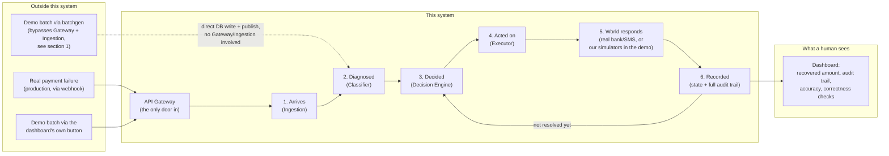

# Data Flow (Momotaro) — plain-English walkthrough

**Status: rough first pass, 2026-08-30.** Written to answer one question —
"where does data come from, where does it go, and what comes out the other
end" — for someone who has never seen this codebase before. It is
deliberately less precise than `docs/ARCHITECTURE.md` §3/§4 (the
implementation-accurate diagrams this document is built from) in exchange
for being readable without already knowing gRPC, Kafka, or this project's
own vocabulary. Treat this as a map, not the territory: when the two
disagree, `docs/ARCHITECTURE.md` is right and this file needs fixing, not
the other way around. Meant to be refined against the actual code later,
not treated as final.

## The one-sentence version

A payment (or mandate) fails somewhere outside this system. This system
finds out about it, figures out *why* it failed and what's actually worth
trying, tries it, watches whether it worked, and shows a human the result —
end to end, with a full paper trail for every decision it made along the
way.

## 1. Where data comes from (outside this system entirely)

**[RECHECK NEEDED]** This section was corrected 2026-08-30 after an earlier
version of this doc showed data reaching Ingestion directly, skipping API
Gateway — wrong, and a direct contradiction of this project's own hard rule
that nothing outside the cluster ever reaches a service except through the
Gateway. The correction below is believed accurate but has not been
independently re-verified end to end against the current code; treat it as
unconfirmed until someone checks it against `services/api-gateway` and
`scripts/batchgen` directly.

Three ways a record can enter, and they don't all take the same route in:

- **Real production traffic**: Razorpay's own platform would send a webhook
  the instant a payment or mandate fails. This always goes **through the API
  Gateway first** (`POST /v1/webhooks/payment-failed`, `docs/API_GATEWAY.md`)
  — the Gateway checks the API key, applies rate limiting, and translates
  the external HTTP call into an internal gRPC call to Ingestion. Nothing
  outside the cluster ever reaches Ingestion, or any other service, directly.
- **The dashboard's own "Submit Batch" button**: takes the exact same route
  as real traffic — through the Gateway, to Ingestion, via the public
  `POST /v1/batches` API. Architecturally identical to the webhook path,
  just a different button pressing it.
- **`scripts/batchgen` (`make batchgen`)**: the one deliberate exception.
  It does **not** go through the Gateway or Ingestion at all — it writes
  straight into Postgres and publishes straight onto the internal Kafka
  topic Ingestion would normally publish to. This is intentional, not a
  bug or a shortcut: only this tool is allowed to write the hidden ground
  truth (below), and the public API has no field for it at all, on purpose,
  so there is no honest way to seed it through the front door. It still
  ends up in exactly the same place as a real event once it's in, the
  difference is only how it got there.

**One thing worth knowing early, because it trips people up**: only
`batchgen` also writes down the *hidden real answer* — what's actually wrong
with each fake record, and whether it's actually recoverable. That hidden
answer is never given to the AI. It exists purely so that later, once the
AI has made its own guess and taken its own action, something can grade it
against the truth. Real production data has no such answer key (nobody
knows in advance whether a real failure is recoverable), which is exactly
why only synthetic data can produce an "accuracy" number at all.

## 2. The journey, step by step, in plain English

Following one single failed payment from the moment it enters:

1. **It arrives.** **[RECHECK NEEDED]** For the webhook and the dashboard
   button, it first passes through **API Gateway** (auth check, rate limit,
   HTTP-to-gRPC translation), which hands it to the **Ingestion** service.
   `batchgen` skips straight to this same point instead (section 1 above).
   Either way, Ingestion (or `batchgen` standing in for it) writes down the
   bare facts (amount, currency, the failure code, which batch it belongs
   to) and hands it off internally for processing. Nothing at this stage
   decides anything yet.
2. **It gets diagnosed.** The **Decision Engine** — the coordinator for
   everything that happens to this record from now on — asks the
   **Classifier** service one question: *why did this actually fail, and what's
   the root cause?* The Classifier answers using a mix of simple rule
   lookups and, when the rules aren't confident enough, a real AI model
   (with automatic fallback if that AI call fails or times out — a plain
   rule always answers eventually, nothing gets stuck).
3. **It gets a decision.** Knowing the root cause, the Decision Engine
   works out what's actually worth doing about it — retry the payment now?
   Wait and retry later? Send the customer a nudge message? Or, if nothing
   is likely to work and it would cost more than it would recover, do
   nothing and flag it for a human instead. This is a real cost/benefit
   calculation, not a guess — every option gets priced.
4. **It gets acted on.** The **Executor** service actually carries out
   whatever was decided — actually retries the payment, or actually sends
   the message. In production this would call a real bank or a real SMS
   provider. In this build, it calls stand-ins instead: the **World
   Simulator** (pretends to be the bank *and* the customer) and the
   **Notification Simulator** (pretends to be the SMS/WhatsApp provider,
   and just logs what it would have sent).
5. **The world responds.** **[RECHECK NEEDED]** (added 2026-08-30, based on
   reading the World Simulator's own contract once, not independently
   verified against its actual behavior end to end.) Executor calls the
   World Simulator with one question: what happened for this record and
   this action? The answer always includes whether it's final yet. For a
   retry, the World Simulator rolls the dice right there, using the hidden
   recoverability odds from step 1, and answers immediately — success or
   failure, no waiting, the same way a real retry against a bank would.
   For a nudge, it almost always answers "not yet" instead, because a real
   customer doesn't reply inside a single call — it quietly remembers to
   check back later (after a simulated delay, compressed so a demo doesn't
   sit there for real hours), and when that time comes, it reports the
   real outcome back to the Decision Engine on its own, without Executor
   asking again.
6. **The result gets written down.** Whatever happened — success, failure,
   still pending — gets recorded as the new state of that record, together
   with a permanent, append-only note explaining *why* (the Classifier's
   reasoning, the cost, the outcome). This record of "what happened and why"
   is never edited or deleted, only added to — which is what makes a full
   audit trail possible later.
7. **If it didn't resolve, go back to step 3** — but smarter this time,
   because it now has more history to work from (how many times has this
   been tried, has this same customer's payment method failed before). This
   loops until the record reaches a real end state: recovered, escalated to
   a human, or deliberately given up on because it wasn't worth chasing
   further.

## 3. What comes out the other end

- **A live dashboard** a human (a merchant's finance/ops person, in the
  product's framing) actually looks at: how much money is at risk right
  now, how much has actually been recovered, how much that recovery cost,
  and — critically — how many records the system *deliberately declined to
  chase* because it wasn't worth it, shown separately from the ones a human
  had to step in on.
- **A complete, replayable trail per record**, drillable from the
  dashboard: every state it passed through, the AI's stated reasoning at
  each step, and — for a nudge — the actual message text that was sent, not
  a summary of it.
- **An accuracy score**, but only for records that came with a hidden
  answer key (step 1): how often the AI's diagnosis actually matched
  reality. This is the number that proves the system is making good calls,
  not just producing plausible-sounding ones.
- **A standing correctness check** running continuously in the background,
  independent of everything else, verifying things like "nothing was
  retried more times than its own budget allowed" and "every state change
  has a matching trail entry with no gaps." This should always read zero
  violations — if it ever doesn't, that is treated as a bug being caught in
  the act, not a business metric.

## 4. A simplified picture

**[RECHECK NEEDED]** (corrected 2026-08-30 — the earlier version of this
diagram skipped API Gateway entirely, which was wrong; not independently
re-verified beyond fixing that one specific mistake.)

## 5. Where to go for the precise, verified version

This document is intentionally soft on implementation detail. For the exact
technical picture — every service, every hop, the actual protocol used at
each step, the database tables involved — see, in order of how closely they
match this walkthrough:

- `docs/ARCHITECTURE.md` §3 ("High-level architecture") — the same picture
  as section 4 above, but with every real service, database, and message
  queue named and every connection labeled with the actual protocol.
- `docs/ARCHITECTURE.md` §4 ("Request-path and event workflow: one record's
  lifecycle") — the same journey as section 2 above, but as an exact,
  ordered sequence of real calls, with the actual data shape at each step.
- `docs/ARCHITECTURE.md` §6, §6a — the World Simulator's hidden-answer-key
  design, and exactly how the live dashboard update reaches a browser.
- `docs/API_GATEWAY.md` — the exact external contract: every route a human
  or a browser can actually call, and the exact shape of what comes back.
- `docs/ARCHITECTURE.md` §10, §10a — the actual database tables, and which
  service is allowed to write to which one.

**Known gap in this first pass**: step 5 (2026-08-30 revision) now
distinguishes the immediate (retry) and delayed (nudge) paths at a
sentence level, but still doesn't walk through what happens *after* a
delayed answer comes back in — how the Decision Engine picks the record
back up, what changes in the database at that moment, whether anything
else needs to happen before step 6. `ARCHITECTURE.md` §4's sequence
diagram has the real, ordered version of this; it hasn't been ported into
plain English here yet.
