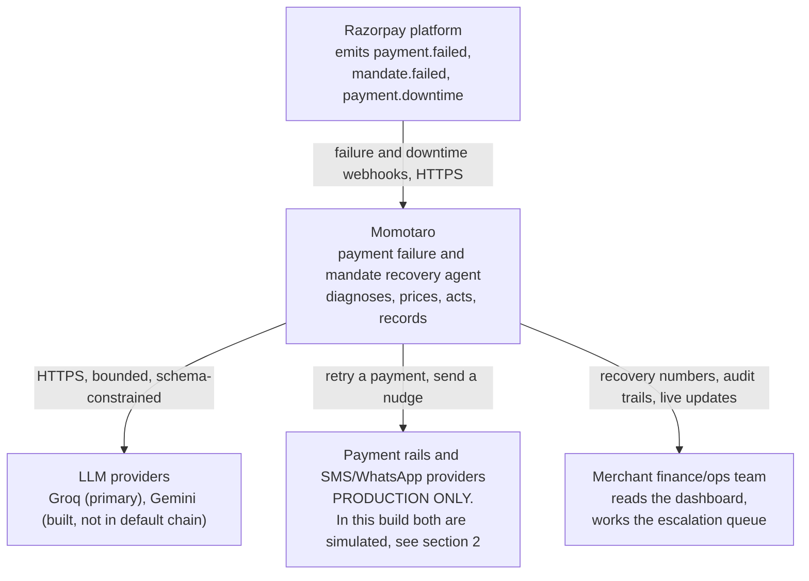
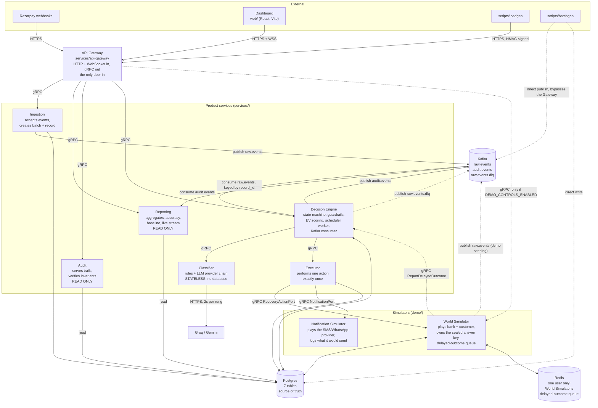
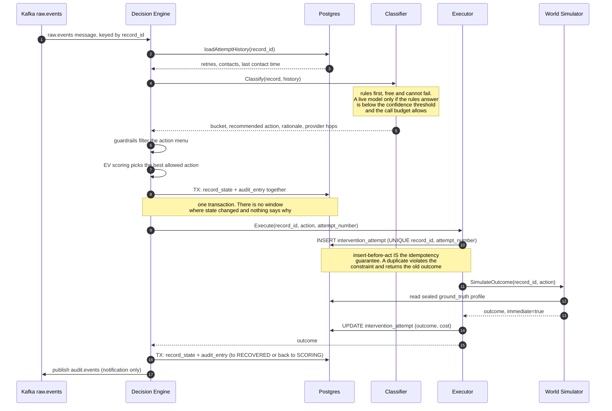
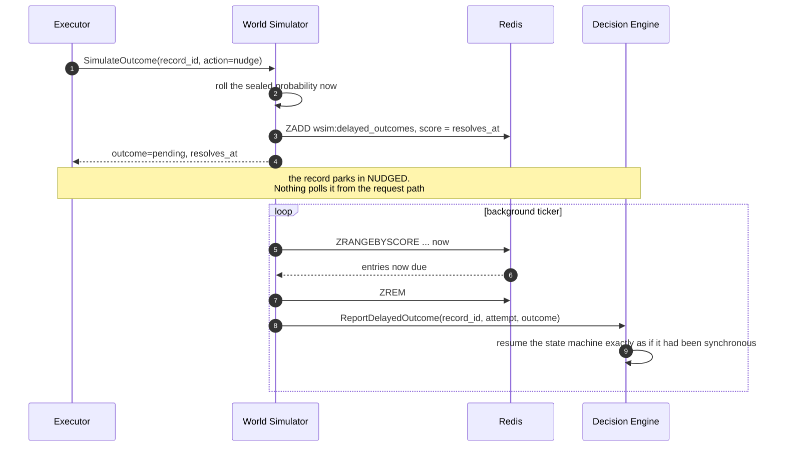
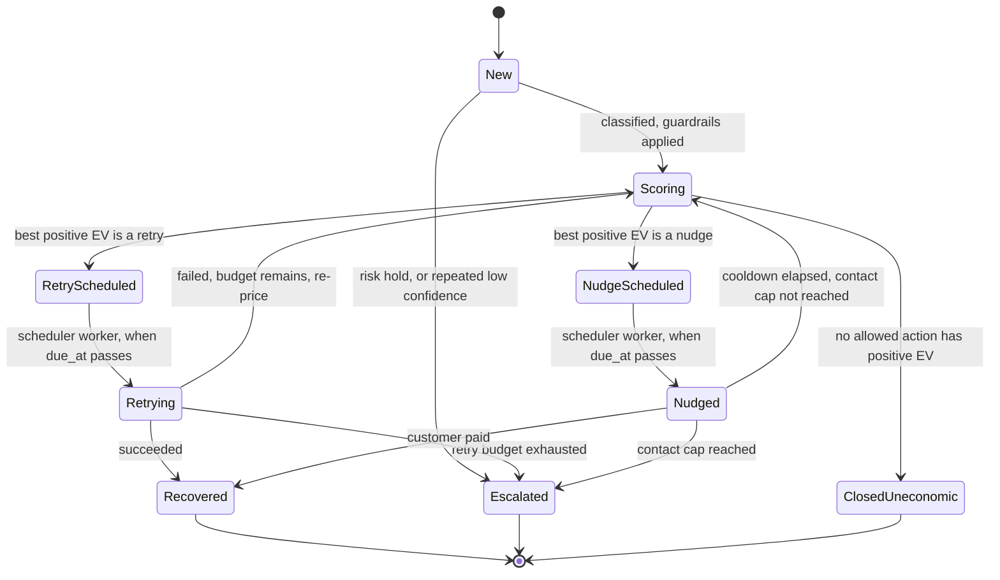
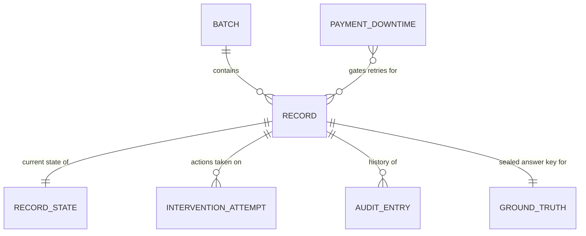

# Data flow

How data enters this system, what happens to it, where it comes to rest, and
who is allowed to write it.

**Every claim and every diagram in this document was verified against the
code on 2026-09-04**, by reading the actual gRPC clients each service
constructs, the actual `INSERT`/`UPDATE` statements each one issues, the
actual Kafka producers and consumers, and the actual struct definitions of
the messages on the wire. Where an earlier version of this document
disagreed with the code, the code won.

**How this differs from `ARCHITECTURE.md`.** That document explains *why*
the system is shaped the way it is: the trade-offs, the rejected
alternatives, the reasoning. This one explains *what moves where*. If you
want to know why Kafka carries only three topics, read that. If you want to
know what is inside a `raw.events` message and which service is allowed to
write `audit_entry`, read this.

Structure follows the [C4 model](https://c4model.com): a context view, then
a container view, then the dynamic and data views. The diagrams are drawn as
plain Mermaid flowcharts rather than Mermaid's experimental `C4Container`
renderer, which is still unreliable on GitHub.

---

## 1. System context

Who and what this system exchanges data with. One box for Momotaro, and
every external party it touches.

**What this system never does**: it does not move money itself, it does not
hold card data, and it does not decide policy. It decides which bounded
action to take on a failure someone else recorded, and it writes down why.

---

## 2. Container view

Every deployable unit, the protocol on every edge, and the three data
stores. Nine services: seven product services under `services/`, two
simulators under `demo/`.

**Three things in this diagram are easy to get wrong and are worth stating
outright**, because earlier versions of this document and of
`ARCHITECTURE.md` got all three wrong:

1. **The Classifier has no database.** It is completely stateless. Any
   record history it reasons about arrives inside the `Classify` request,
   loaded by the Decision Engine.
2. **Redis has exactly one user**, the World Simulator, for its
   delayed-outcome sorted set. Every service is *required* to set
   `REDIS_ADDR` at startup, and eight of the nine never open a connection
   with it.
3. **Audit and Reporting never write.** Neither issues a single `INSERT`,
   `UPDATE` or `DELETE`. Audit's "continuous verification" is a read loop.

---

## 3. Three ways in, and why they differ

All three converge on the same `raw.events` topic, and nothing downstream
can tell which door a record came through. What differs is who wrote the
row and whether a sealed answer key exists.

| Path | Route | Writes ground truth? | Gets accuracy + baseline? | Purpose |
|---|---|---|---|---|
| **Production webhook** | `POST /v1/webhooks/payment-failed` to Gateway, then gRPC to Ingestion | No | No | the real path, one event at a time, forever |
| **Demo Controls panel** | `POST /v1/demo/batches` to Gateway, then gRPC to World Simulator's `SeedBatch` | **Yes** | **Yes** | the demo path, seeded from the dashboard |
| **`scripts/batchgen`** | direct `INSERT` to Postgres plus direct Kafka publish, **bypasses Gateway and Ingestion entirely** | **Yes** | **Yes** | the CLI equivalent of the panel |

**Why `batchgen` is allowed to bypass the front door.** Only a `demo/` or
`scripts/` component may ever write `ground_truth`. The public API has no
field for it, deliberately, so there is no honest way to seed an answer key
through the Gateway. `SeedBatch` is the same rule expressed differently: the
Gateway forwards the request, but the row is written by World Simulator,
which already holds ground-truth permission for the read side.

**Why the answer key matters.** Ground truth is what turns "the agent
recovered some money" into "the agent classified 92% of failures correctly
and beat a naive policy by a measured margin." Real production data has no
answer key, because nobody knows in advance whether a real failure was
recoverable. A batch seeded without one gets no accuracy score, and the
dashboard says so rather than showing an empty panel.

The decision path provably cannot read that table. Enforced by
`test/integrity/ground_truth_isolation_test.go`.

---

## 4. One record's journey

The dynamic view: what actually happens, in order, to a single failed
payment. This is the immediate path, where the bank answers straight away.

### The delayed path

A retry against a bank resolves in seconds, so it stays synchronous. A
customer responding to a nudge does not, and modelling that honestly is the
reason the delayed path exists.

The state machine does not care which of the two paths an outcome arrived
by. Both reach the Decision Engine in the same shape.

---

## 5. Record lifecycle

The states a record can occupy, verified against `RecordState` in
`proto/common/v1/common.proto`.

**`Scoring` is a real state, not an inline branch.** Every record passes
through it before any money is spent, and re-enters it after every failed
attempt, so an action worth trying on attempt one can be judged not worth
trying on attempt three as the remaining probability falls.

**Three terminal states, and the distinction matters.** `Recovered` is the
money coming back. `Escalated` means a human should look at this.
`ClosedUneconomic` means the agent decided chasing it costs more than it
would recover. Collapsing the last two would hide the single most
interesting thing this system does.

**`RetryScheduled` and `NudgeScheduled` are waiting states.** The record
sits with a `due_at` timestamp until the Decision Engine's scheduler worker
claims it with `FOR UPDATE SKIP LOCKED`. Nothing polls them from the
request path.

---

## 6. Data at rest

Seven tables. Ownership verified by reading every `INSERT` and `UPDATE`
statement in the repo.

| Table | Written by | Read by | Holds |
|---|---|---|---|
| `batch` | Ingestion; also World Simulator `SeedBatch` and `scripts/batchgen` | Decision Engine, Reporting, Audit | one row per submitted batch |
| `record` | same three | Decision Engine, Reporting, Audit | the immutable facts: amount, currency, failure code, instrument, type |
| `record_state` | **Decision Engine only** | Reporting, Audit | current state, attempt count, `due_at`, root cause, EV snapshot |
| `intervention_attempt` | **Executor only** (`INSERT` before acting, `UPDATE` with the outcome) | Decision Engine, Reporting, Audit | one row per action: type, outcome, `cost_paise`, EV and probability at decision time, the nudge message text |
| `audit_entry` | **Decision Engine only**, in the same transaction as the state change, append-only | Audit, Reporting | from-state, to-state, reason, rationale, provider hops, decision trace |
| `ground_truth` | **`scripts/batchgen` and World Simulator only** | World Simulator, Reporting's accuracy scorer **only** | true bucket, recovery probability, wrong-action probability, response delay, roll key |
| `payment_downtime` | **Decision Engine only**, via `ReportDowntimeEvent` | Decision Engine's own guardrail check, read fresh every time, never cached | active Razorpay-reported outages |

**No service writes a table it does not own.** Cross-service reads go
through these tables; they never reach into another service's internal
queries.

**Why `audit_entry` has exactly one writer.** An earlier design had the
Decision Engine write state to Postgres and then publish to Kafka, with the
Audit service writing the trail from that stream. That is the dual-write
problem: a pod dying between the commit and the publish loses the audit
entry forever. Now the service that owns a state change writes both rows in
one transaction. Either both land or neither does.

---

## 7. Data in motion

Three Kafka topics, all keyed by `record_id` so per-record ordering
survives partitioning.

| Topic | Producers | Consumer | Payload |
|---|---|---|---|
| `raw.events` | Ingestion; World Simulator (demo seeding); `scripts/batchgen` | Decision Engine, via a keyed worker pool | `{record_id, batch_id, type, amount_paise, currency, failure_code, instrument_ref, created_at}` |
| `audit.events` | **Decision Engine only** | Reporting | `{record_id, batch_id, from_state, to_state, recovered_delta_paise, timestamp}` |
| `raw.events.dlq` | **Decision Engine only** | nothing automated; inspected by hand | the original message plus the failure reason |

**`audit.events` is a notification, never a system of record.** It is
published strictly after the owning Postgres transaction has committed, and
a publish failure is logged rather than propagated. Losing one costs a
missed live-dashboard tick, never a wrong number and never a missing audit
entry, because the trail is already durable in Postgres.

**The DLQ is a bug signal, not a business outcome.** Records in it are
counted as processing failures and reported separately. Folding a crash into
a recovery metric would make the batch report dishonest.

---

## 8. What comes out

Everything external arrives through the Gateway on `:8090`. Full contract in
[`API_GATEWAY.md`](API_GATEWAY.md).

| Output | Route | Derived from |
|---|---|---|
| Batch report: at-risk, gross and net recovered, spend, cost per rupee, recovery rate by bucket and by intervention | `GET /v1/batches/{id}/report` | Postgres aggregates, computed per read |
| Classification accuracy and confusion matrix | same report | predicted bucket vs `ground_truth`, scored only when an answer key exists |
| Naive-baseline comparison | same report | the same sealed ground truth, evaluated analytically against a fixed retry-3-nudge-1 policy |
| Per-record audit trail, including the decision trace of alternatives priced and rejected | `GET /v1/records/{id}/audit` | `audit_entry`, append-only |
| Live updates as records change state | `WS /v1/batches/{id}/live` | Reporting's `StreamBatchUpdates`, fed by `audit.events`, relayed by the Gateway |
| Continuous invariant results | `GET /v1/batches/{id}/invariants` | Audit's read-only verifier: stopping-rule violations, incomplete trails, impossible transitions |

The invariant results should always read zero. If one is ever non-zero it is
a bug caught in the act, not a business metric.
